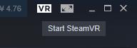
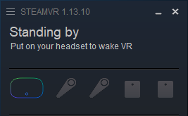
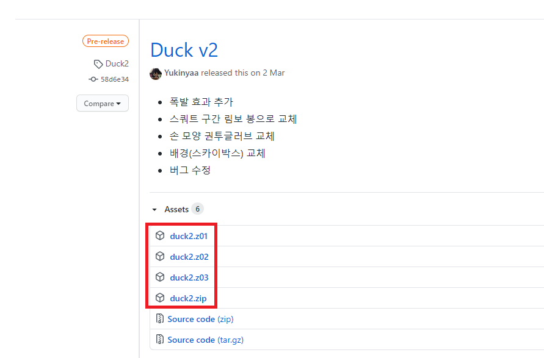

# BoxerVR

## 개요
BoxerVR은 어쩌구저쩌구..

## 실행방법

### 준비
1. Steam을 다운로드 후 설치하고, 계정으로 로그인합니다. [다운로드 페이지]https://store.steampowered.com/about/)
   - 이를 위해서 Steam 계정을 생성해야 합니다.
2. Steam에서 SteamVR을 설치합니다. [바로 설치/실행 링크](steam://run/250820)
3. 설치가 완료되면, Steam 창의 오른쪽 위의 VR 버튼을 클릭해 SteamVR을 실행합니다.
    
    버튼이 초록색으로 바뀌고, 다음과 비슷한 창이 뜨면 준비가 완료 된 것입니다.
   

#### 주의사항

* Steam 창은 종료해도 되지만, SteamVR창은 종료하시면 안됩니다.

### 다운로드/실행

#### BoxerVR의 최신 버전 다운로드

- [다운로드 페이지](https://github.com/Yukinyaa/BoxerVR/releases)로 이동합니다.

- 맨 위의 버전의 `Assets` 버튼을 눌러 하위 항목에 있는 zip 분할압축 파일 을 모두 받습니다.(`*.zip, *.z01, *.z02 ...`)

- 

- 알집, 반디집 등의 압축 프로그램으로 압축을 풉니다.

- "BoxerVR" 을 실행합니다.

  ### 주의사항

  - 아직 종료 기능이 제대로 구현되지 않았습니다.
    `Alt + F4` 키를 이용해 프로그램을 종료하시면 됩니다.